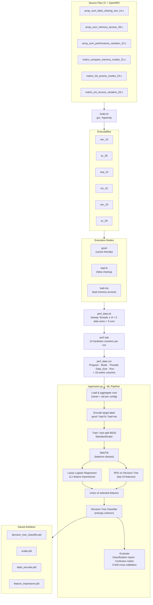

# Pipeline Flowchart

```mermaid
flowchart TD
    subgraph SRC["Source Files (C + OpenMP)"]
        A1["array_sum_false_sharing_sim_14.c"]
        A2["array_sum_memory_access_28.c"]
        A3["array_sum_performance_variation_10.c"]
        A4["matrix_compare_memory_modes_31.c"]
        A5["matrix_init_access_modes_23.c"]
        A6["matrix_init_access_variation_29.c"]
    end

    BUILD["build.sh\ngcc -fopenmp"]

    subgraph EXE["Executables"]
        E1["vec_14"]
        E2["sc_28"]
        E3["seq_10"]
        E4["mc_31"]
        E5["vec_23"]
        E6["sc_29"]
    end

    subgraph MODES["Execution Modes"]
        M1["good\n(cache-friendly)"]
        M2["bad-fs\n(false sharing)"]
        M3["bad-ma\n(bad memory access)"]
    end

    SWEEP["perf_data.sh\nSweep: threads 1–8 × 5 data sizes × 3 runs"]

    PERF["perf stat\n15 hardware counters per run"]

    CSV["perf_data.csv\nProgram · Mode · Threads · Data_Size · Run\n+ 18 metric columns"]

    subgraph ML["regression.py — ML Pipeline"]
        ML1["Load & aggregate runs\n(mean + std per config)"]
        ML2["Encode target label\ngood / bad-fs / bad-ma"]
        ML3["Train / test split 80/20\nStandardScaler"]
        ML4["SMOTE\n(balance classes)"]
        ML5["Lasso Logistic Regression\n(L1 feature importance)"]
        ML6["RFE on Decision Tree\n(top-10 features)"]
        ML7["Union of selected features"]
        ML8["Decision Tree Classifier\n(entropy criterion)"]
        ML9["Evaluate\nClassification report · Confusion matrix\n5-fold cross-validation"]
    end

    subgraph OUT["Saved Artefacts"]
        O1["decision_tree_classifier.pkl"]
        O2["scaler.pkl"]
        O3["label_encoder.pkl"]
        O4["feature_importance.pkl"]
    end

    SRC --> BUILD --> EXE
    EXE --> MODES
    MODES --> SWEEP
    SWEEP --> PERF
    PERF --> CSV
    CSV --> ML1
    ML1 --> ML2 --> ML3 --> ML4 --> ML5
    ML4 --> ML6
    ML5 --> ML7
    ML6 --> ML7
    ML7 --> ML8 --> ML9
    ML8 --> OUT
```
